# Desplegar aplicación web en la nube de google

## Intro

Senda se puede instalar en cualquier entorno: no obstante aquí se facilitan instrucciones para desplegar en la nube de google.

## Paso 0: instalar las herramientas de google de linea de comandos 

Aunque no es estrictamente necesario, para estas instrucciones vamos 
a describir los pasos tanto con la linea de comandos como con el interfaz
de usuario. La linea de comandos tiene la ventaja de que te permite 
automatizar los pasos. 

Para ejecutarlo mediante linea de comandos hay que descargarse [la 
interfaz de linea de comandos de google](https://cloud.google.com/sdk/docs/install?hl=en).

En el caso de linux, descomprimimos: 

    $ tar -xzf google-cloud-cli-385.0.0-linux-x86_64.tar.gz

Y la podemos dejar instalada en una carpeta personal: 

    $ mv google-cloud-sdk ~/bin
    $ echo -e '\n\nexport PATH=$PATH:~/bin/google-cloud-sdk/bin' >> ~/.bashrc

Y configuramos la aplicación:

    $ gcloud config set account YOUR-GOOGLE-ACCOUNT@gmail.com
    $ gcloud auth login 
    

## Paso 1: construir la aplicación

Si no lo hemos hecho aún, es preciso construir la aplicación: 

    $ ionic build 

Esto creará una carpeta `www` donde estará instalada nuestra aplicación. 

## Paso 1: crear un bucket en la nube de google

### Web

Entraremos en la consola de administración de la nube de google [https://console.cloud.google.com/](https://console.cloud.google.com/) y haremos clic
en la parte superior y "nuevo proyecto":

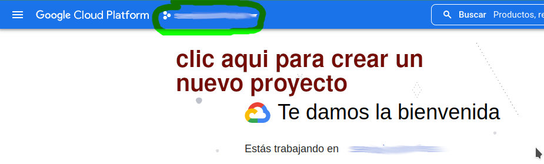

Para este ejemplo el proyecto recibirá el nombre de `NOMBRE-DEL-PROYECTO`. A 
continuación lo seleccionaremos para comenzar a trabajar con él.

### Linea de comandos

    $ gcloud projects create ID-DEL-PROYECTO \
    --name='NOMBRE-DEL-PROYECTO' \
    $ gcloud config set project ID-DEL-PROYECTO

## Paso 2: crear un cloud storage para almacenar nuestro proyecto

Para este tutorial daremos al bucket el nombre de `senda-bucket`, aunque 
puede darse cualquier otro nombre. 

### Web

En el menú de la parte superior seleccionaremos `Cloud Storage`y `Browser`: 

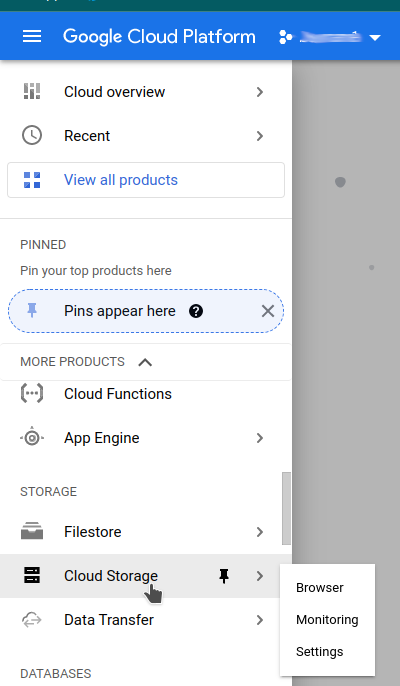

y create bucket: 

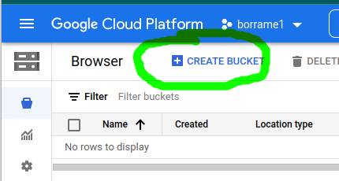

Facilitar un nombre:

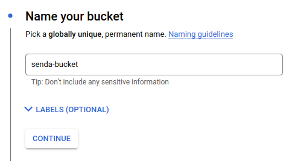

La clase de almacenamiento será "estandar":

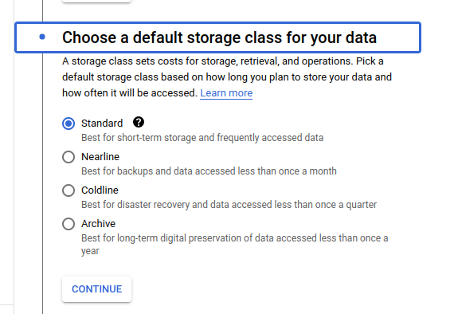

El novel de acceso será "uniform" (no descartamos que sea necesario
cambiarlo en un futuro): 

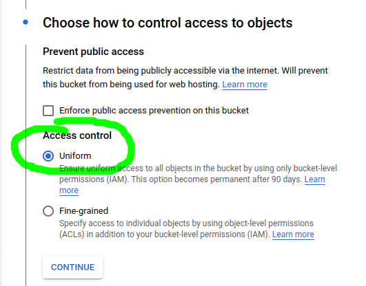

**Y finalmente clic en "crear" y tras un ratito tendremos nuestro bucket felizmente creado. 

Una vez creado, clic en la opción permisos para dar permisos de 
acceso públicos: 

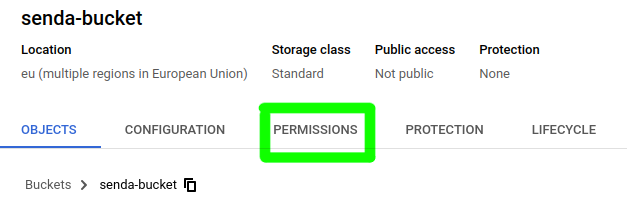

Clic en añadir:

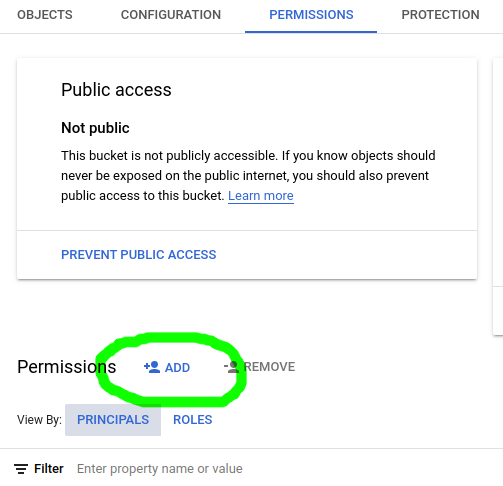

Y añadiremos el rol `Storage Legacy Object Reader` para `allUsers`:

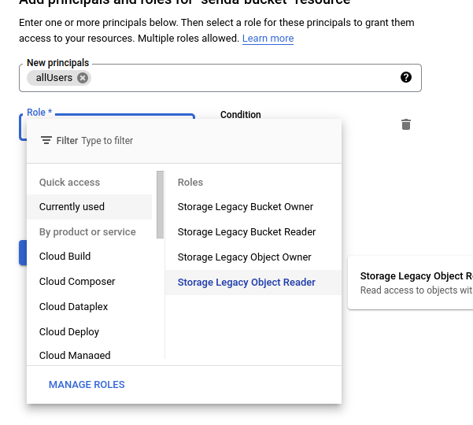

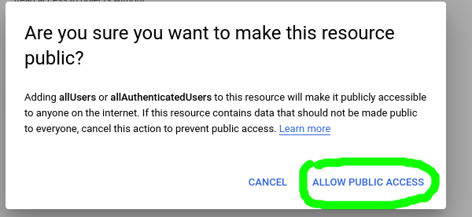

### Linea de comandos

    $ gsutil mb gs://senda-bucket

**Pendiente:** dar permisos. 

**Ojo!!!** Es posible que nos dé un error "The billing account for the 
owning project....": en ese caso tendremos que acceder vía web y 
habilitar la facturación. Esto no significa necesariamente que nos
vayan a cobrar; los costes se aplican cuando se supere la capa
gratuita.

## Paso 3: subir los ficheros de `build`

### Web

Via web será tan sencillo como pulsar `subir ficheros` y seleccionar
todos los ficheros que tenemos en la carpeta `www`:

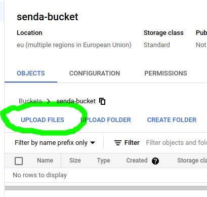

### Linea de comandos

    $ gsutil -m rsync -r -d www/ gs://senda-bucket2  

**Este comando será especialmente util cuando hagamos sucesivas
iteraciones de desarrollo.**

## Paso 4: crear un balanceador de carga

Crearemos un balanceador de carga que será el frontal encargado
de recibir las peticiones web. Ese tráfico será redirigido al contenido 
apropiado del bucket. 

**Nota:** más adelante aquí habrá que incluir las oportunas 
modificaciones para soportar tráfico seguro (https://).

### Web

En el menú de la consola, buscaremos `Servicios de red` -> `balanceo de carga`: 

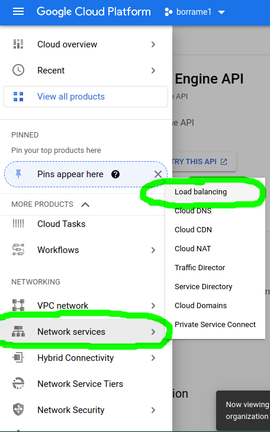

Es posible que nos solicite habilitar el `Compute Engine API`,  en cuyo 
caso seleccionaremos 'Habilitar'. A continuación, `crear balanceador de 
carga`: 

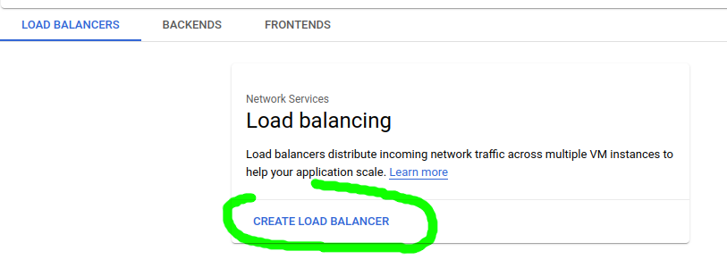

Seleccionaremos un balanceador de tipo HTTP: 

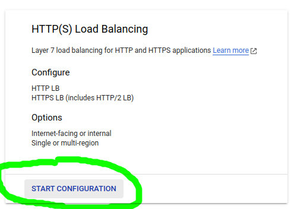

Y los valores de configuración por defecto: 

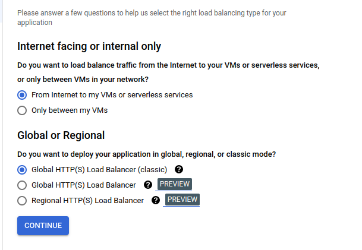

A continuación le daremos un nombre y seleccionaremos "crear un bucket
de backend": en realidad lo que va a hacer es crear un emparejamiento entre el balanceador y el cloud storage que acabamos de crear.

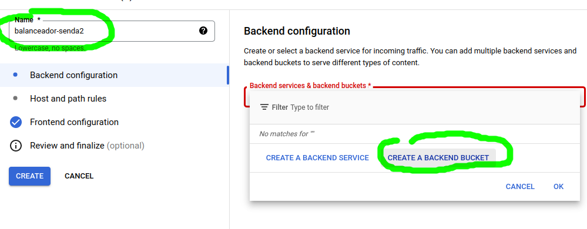

Y ahí sí, emparejamos en el bucket: 

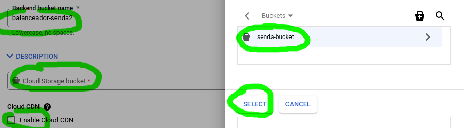

Para mejorar la disponibilidad he seleccionado "Enable Cloud CDN".  
Y clic en crear. 

A continuacion seleccionaremos el balanceador creado y tomaremos 
nota de la IP que nos facilite: ésa será -de momento- la dirección 
de nuestra aplicación. Más adelante explicaremos cómo darle un 
dominio y un certificado seguro.  

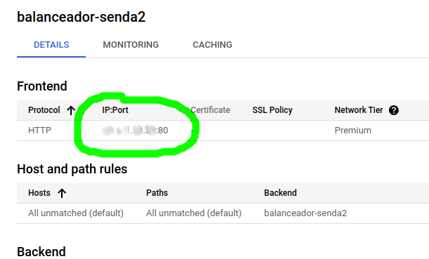

### Linea de comandos

    $ 

